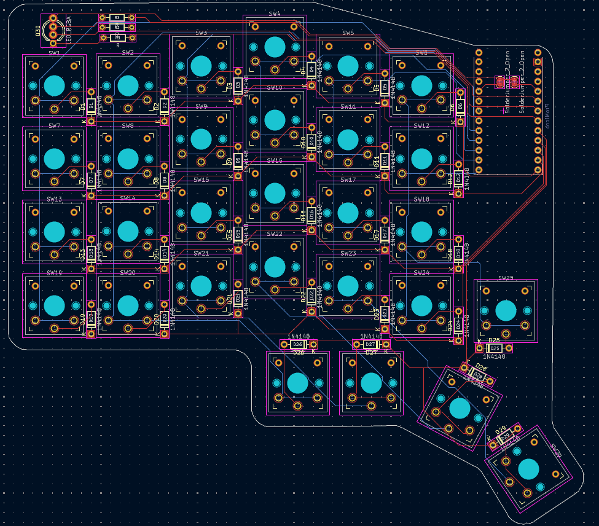
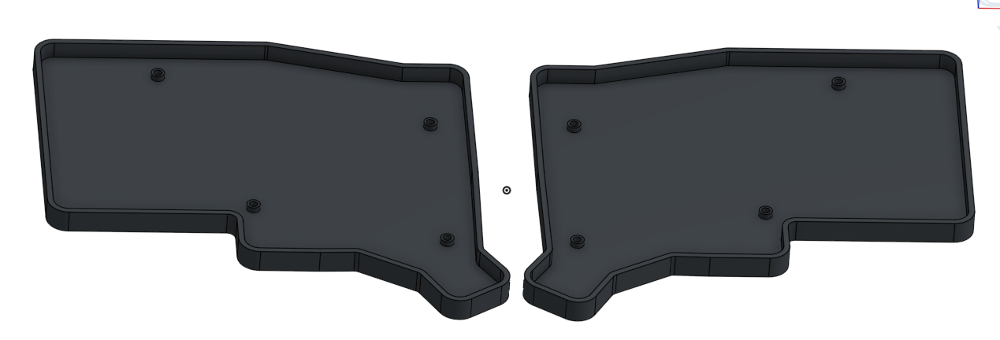

Total time spent so far: ~21 hours

# July 1st: Brainstorming and pcb
I started by listing what my keyboard needs to have:
- quiet
- as slim as posible, while being durable to fit in my school bag
- tactile switches - I've tested linear swithes on keyboards in tech shops, but I don't like them - lack of feedback makes me misstype more often
- ~50 keys (number row, 6th column and thumb keys)
- wireless
- usb-c (nearly every device I am using is using it)

Then I searched for switches that would fit in those requirements and I've found them - Kailh Deep Sea Whale mini switches.

Having a list of requirements and switches I started designing.

First I designed the layout in Ergogen. I've used it to make my first keyboard, so I already knew what to do and what I need.

Once I was happy with the key layout, I started designing the actual circuit. 
BTW: This was my first time using Kicad and designing pcbs.

I've choosen Seeed Studio XIAO nRF52840 as the microcontroller as I want to use ZMK as firmware.

Because I wanted to use Choc v2 switches and Seeed XIAO mcu I needed to find required kicad files before doing anything.
Quickly I've found siderakb's switch footprints and oficial XIAO kicad files.

Schematic is simple. Just switches, diodes and microcontroller. I've also added jumpers to make one pcb for both halves.

Then came the time for the pcb. Ergogen generated a base pcb, but I needed to swap all switch footprints to the right ones. (Only later I've read on the Highway website that there is a tool that would have done that for me)

PCB design isn't as hard as I thought, but it is tedious. While I don't think that my pcb is great, it should work just fine.

Total time spent: ~8 hours

# July 5th: PCB changes and BOM

While looking for parts on Aliexpress I found cheaper mcu - clones of nice!nano v2, and I decided to use them instead of XIAOs.
Also I realised that to make the PCB reversible I also needed to modify key switch footprints.

Which meant rewiring was required - yay! /s

While rewiring I also added an RGB led indicator (XIAO has one bulit in, but n!n doesn't).

Total time spent: ~3 hours

# July 6th: case

Today I worked on shells for each keyboard half.

I used Onshape for this. It was my first time using a proper CAD software (earlier I only used Tinkercad). While I quickly learned basics, I still don't know what most of its tools do.

Today I also searched for parts, filled out the BOM and calculated prices for everyting.

Total time spent: ~6 hours

# July 7th: firmware and case pt.2

I decided to modify the case to add a plate for the switches.

Today I mostly worked on the ZMK firmware configuration.
I followed the guide from ZMK's docs.

After completing it and fixing a few small errors, I've got it to successfully compile.

Total time spent: ~4 hours
