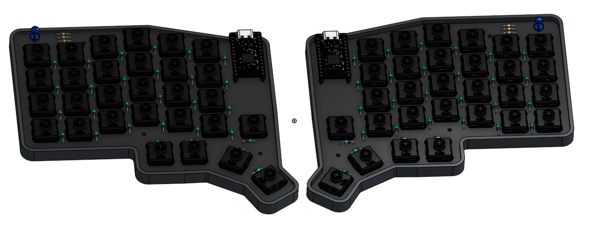

# LQS keyboard
**L**ow profile **Q**uiet **S**plit keyboard

## Why have I decided to build a keyboard?
A few years ago I received an 80% mechanical keyboard as a Christmas gift. It has been my daily driver since then.
But it has two issues:
1. It is too big and chunky to travel with or take it to school.
2. It is too loud. While it is quieter than some mechanical keyboards, you can easily hear it from the other side of my flat.

Since then Youtube algorithm has introduced me into the custom keyboard rabbit hole.
I've built a simple one using 3d printed parts and handwiring. It worked, but it was thick and after a few weeks it started to slowly break apart. First random solder joints started breaking, then the case cracked.

I wanted to build a proper keyboard, but I was too lazy to do it.
Highway gave me the motivation that I needed to finally do it.

## CAD model

## Switch layout
Switch layout was inspired by two keyboards I like: ZSA Voyager and Sofle

## BOM

| Part | Quantity | Cost(PLN) | Cost (USD) | Store | Link |
| --- | --- | --- | --- | --- | --- |
| Kailh Deep Sea Whale mini switches | 58 | 113.99 | 29.70 | Aliexpress | https://pl.aliexpress.com/item/1005008927866337.html |
| Pro Micro NRF52840 | 2 | 26.78 | 7.04 | Aliexpress | https://pl.aliexpress.com/item/1005006599766097.html |
| 301230 lipo battery | 2 | 45.25 | 11.70 | Allegro.pl | https://allegro.pl/oferta/akumulator-litowo-polimerowy-110mah-3-7v-phr-2-bk-301230-17500532114 |
| 1n4148 diodes | 58 | 5.55 | 1.47 | Aliexpress | https://pl.aliexpress.com/item/4000142272546.html |
| RGB common anode 5mm led | 2 | 3.99 | 1.05 | Aliexpress | https://pl.aliexpress.com/item/4000225253691.html |
| pin sockets | 52 pins | 7.10 | 1.87 | Aliexpress | https://pl.aliexpress.com/item/10000000838267.html |
| PCB | 5 | 41.80 | 11.60 | JLCPCB | https://jlcpcb.com/ |
| M2 4mm flat head screws | 8 | 3.55 | 0.87 | Aliexpress | https://pl.aliexpress.com/item/1005005270702287.html | 
| M2 3x3mm heat inserts | 8 | 5.6 | 1.47 | Aliexpress | https://pl.aliexpress.com/item/1005008295045821.html?pdp_ext_f=%7B%22sku_id%22%253A%2212000044536166973%22%7D |
| resistors for leds | 6 | ~4 | ~1 | Aliexpress |  |
| keycap set | 1 | ~120 | ~35 | Aliexpress | |

Total: ~380 PLN / ~$105 USD

I already have keycaps and resistors.

Total excluding parts I have, with shipping:
$67 + $21 (JLCPCB shipping) + $0 (Aliexpress Choice free shipping) = $88